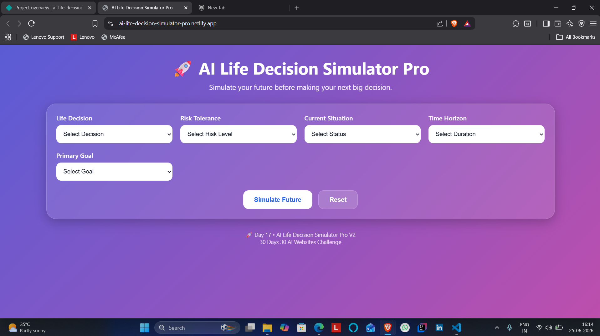
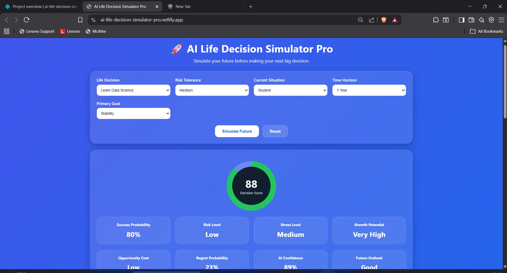
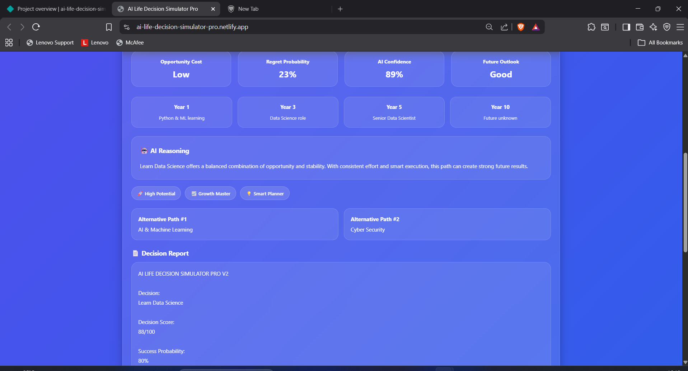
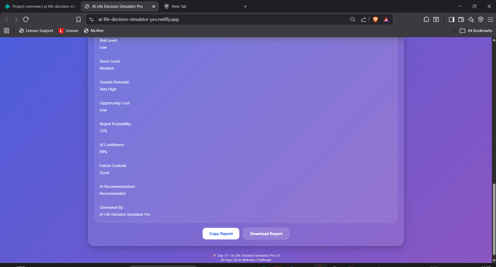

# AI Life Decision Simulator Pro

## 🚀 Day 17 of my 30 Days 30 AI Websites Challenge

AI Life Decision Simulator Pro is an AI-inspired decision-support tool designed to help users evaluate major life choices before committing to them.

The platform analyzes different factors such as risk tolerance, career goals, current situation, and future time horizon to simulate potential outcomes and provide intelligent insights.

Instead of relying purely on emotions or assumptions, users can explore a structured decision analysis with future projections, opportunity costs, growth potential, and personalized recommendations.

## 🌐 Live Demo

https://ai-life-decision-simulator-pro.netlify.app/

## 📸 Screenshots

## ✨ Features

* Decision Score Analysis
* Success Probability Prediction
* Risk & Stress Assessment
* Growth Potential Evaluation
* Opportunity Cost Analysis
* Regret Probability Estimation
* AI Confidence Score
* Future Outlook Prediction
* Dynamic Career & Life Timeline
* Alternative Path Suggestions
* AI Reasoning Engine
* Report Generation
* Copy Report Feature
* Download Report Feature
* Fully Responsive Design

## 📋 How It Works

1. Select a life decision.
2. Choose your risk tolerance.
3. Select your current situation.
4. Choose a future time horizon.
5. Select your primary goal.
6. Run the simulation.
7. Review the generated insights and recommendations.

## 🛠️ Technologies Used

* HTML
* CSS
* JavaScript
* Built with the help of AI-assisted development tools

## 🎯 Challenge Progress

✅ Day 17 Completed — AI Life Decision Simulator Pro

Part of my **30 Days 30 AI Websites Challenge**, where I build and publish one AI-powered web project every day to improve my product development, problem-solving, and software engineering skills.

## 👨‍💻 Author

Bettam Anand

B.Tech CSE (Data Science)

JNTUH University College of Engineering Palair
